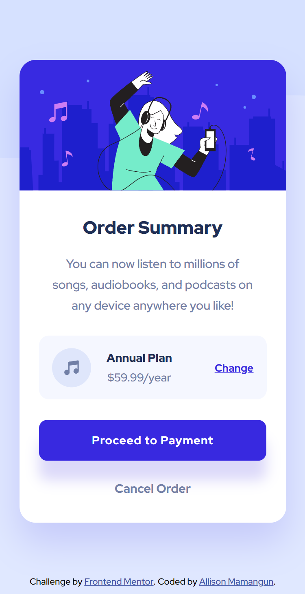

# Frontend Mentor - Order summary card solution

This is a solution to the [Order summary card challenge on Frontend Mentor](https://www.frontendmentor.io/challenges/order-summary-component-QlPmajDUj). Frontend Mentor challenges help you improve your coding skills by building realistic projects. 

## Table of contents

- [Overview](#overview)
  - [The challenge](#the-challenge)
  - [Screenshot](#screenshot)
  - [Links](#links)
- [My process](#my-process)
  - [Built with](#built-with)
  - [What I learned](#what-i-learned)
  - [Continued development](#continued-development)
  - [Useful resources](#useful-resources)
- [Author](#author)
- [Acknowledgments](#acknowledgments)

## Overview

### The challenge

- To build out this order summary card component and get it looking as close to the design as possible.

Users should be able to:

- See hover states for interactive elements

### Screenshot




### Links

<!-- - Solution URL: [Add solution URL here](https://your-solution-url.com) -->
- Live Site URL: https://allisondev16.github.io/order-summary-component-main/

## My process

### Built with

- Semantic HTML5 markup
- SCSS
- Flexbox

### What I learned

- I included '/' at the beginning of the path of the images at first, but it's working with SCSS. However, the images were not rendered/displayed when the compiled CSS was used. I figured out that I should remove '/' to work.

- I'm proud of using (thanks Coder Coder)
```css
overflow: hidden;
```

- Usage of flexbox with justify-content and align-items

- I learned how to use SCSS. The styles for each element or section are easily managed when I use SCSS. Nesting using SCSS is a life-saver as I can easily manage the styles of a section, especially when working with a lot of styles. 

- I find it easier to play along with CSS using the Chrome Developer tools, unlike when you code directly that you need to save to see the output. When I'm satisfied with the output, I only need to copy and paste the code from the tool to the actual code, which is more efficient. I learned this technique when I code-along with Coder Coder.

- I leveraged more the chrome developer tools by using increase and decrease of pixels, there's even a customization tool for colors that support formats, hsla, rgba, and #, which can be converted by just clicking a button. For the box-shadow style, hsl/hsla is not working so I used rgba just like Coder Coder's Easybank landing page.

- How to position the background image? Use background-position ;)

- I know Coder Coder used Adobe software to measure the sizes of the images, but I just discovered that I can use MS Paint when I was close to finishing this challenge! But you know what they say, it's always never too late.

- I've practiced using media query and transition.

### Continued development

I want to enhance my skills more on frontend development. My next target is to create a landing page that I could find in Frontend Mentor.

### Useful resources

- [How to Make a Landing Page using HTML, SCSS, and JavaScript - Full Course by Coder Coder](https://youtu.be/aoQ6S1a32j8) - This helped me with this project. I liked that I could watch how a pro Frontend Developer such as Coder Coder makes a landing page from Frontend Mentor. In this YouTube video, I learned techniques in which I applied to this project. It's also the video that taught me SCSS for the first time.

## Author

- GitHub - [Allison Mamangun](https://github.com/allisondev16)
- Frontend Mentor - [@allisondev16](https://www.frontendmentor.io/profile/allisondev16)

## Acknowledgments

I thank Coder Coder on YouTube for her content to share her expertise in frontend development.
